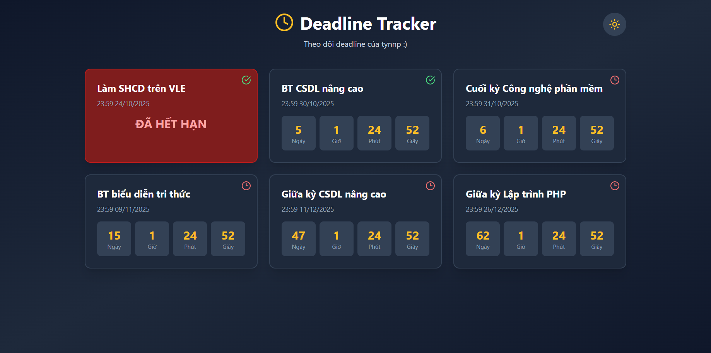

# Deadline Tracker

Ứng dụng **React** đơn giản để theo dõi và quản lý deadline với **đồng hồ đếm ngược thời gian**.

<p align="center">
  
</p>

---

## Tính năng

- Hiển thị **danh sách deadline** được sắp xếp theo **thời gian sắp tới**.  
- **Đồng hồ đếm ngược** (ngày, giờ, phút, giây) cho từng deadline.  
- **Chế độ tối/sáng** (toggle bằng icon).  
- Thiết kế **responsive**, hỗ trợ **mobile** và **desktop**.  
- Hiển thị **cảnh báo khi deadline đã hết hạn**.  
- **Ngôn ngữ:** Tiếng Việt.

---

## Công nghệ

- **React 18 + TypeScript**
- **Vite** (build tool)
- **Tailwind CSS** (styling)
- **Lucide React** (icons)

---

## Cài đặt

### Clone repository:
```bash
git clone https://github.com/tynnp/account-manager-app
cd deadline-tracker
```

### Cài đặt dependencies:
```bash
npm install
```

### Chạy dev server:
```bash
npm run dev
```

Sau đó mở trình duyệt tại: **http://localhost:5173**

---

## Sử dụng

Các deadline được định nghĩa trong file `deadlines.ts`.  
Thêm/sửa/xóa các mục theo định dạng sau:

```ts
{
  id: 'unique-id',
  title: 'Tên deadline',
  date: 'YYYY-MM-DD',  // Ví dụ: '2025-10-31'
  time: 'HH:MM',       // Ví dụ: '23:59'
  done: false         
}
```

Ứng dụng tự động **cập nhật thời gian real-time** và **sắp xếp deadline** theo thứ tự gần nhất.

---

## Build cho production

```bash
npm run build
```

Kết quả build sẽ nằm trong thư mục **`dist/`**.

---

## Hỗ trợ

Nếu gặp vấn đề hoặc muốn đóng góp, hãy mở **issue** trong repository này!
